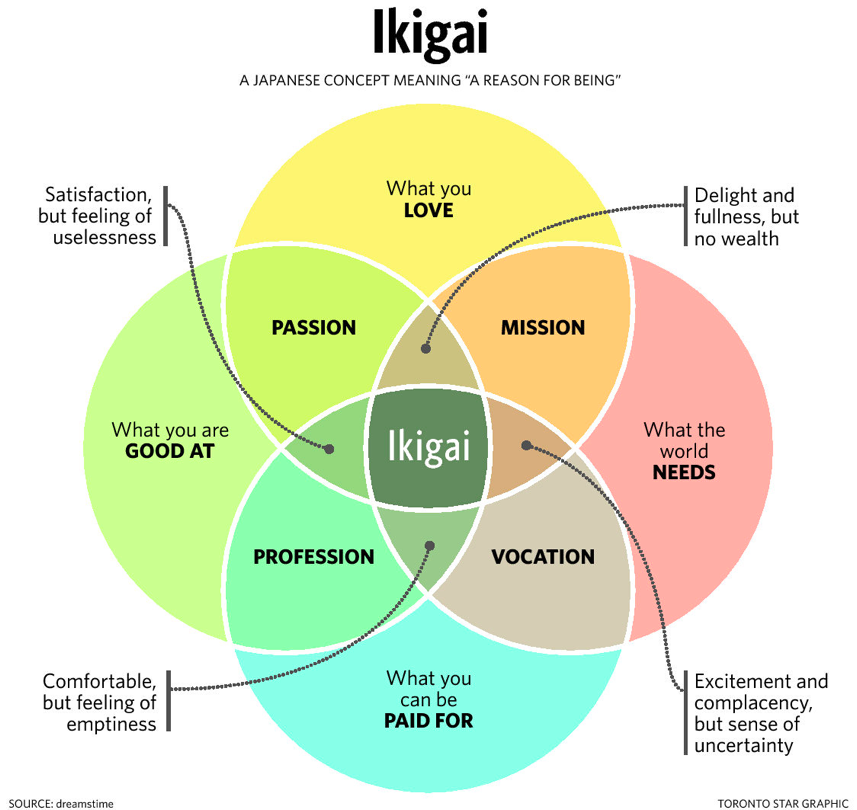

### Profession
I'm a Financial Software Developer working on the FXGO Options trading platorm at Bloomberg LP

### Passion
 * Game Design
 * ML / Data Science
 * Artistic programming (See my LED board project)

### What I love
 * Playing guitar / singing
 * Rock Climbing
 * Brazilian Jiu Jitsu

Still working on my Ikigai, but I hope to find it in ML research.

### My history in a breath
 * Grew up in the San Francisco Bay Area
 * Attended the wonderful [Peninsula School](https://www.peninsulaschool.org/), followed by [Summit Prep](https://summitps.org/our-schools/summit-prep-redwood-city/)
 * Attended [UCLA](http://www.ucla.edu/) and got my Bachelors in Computer Science
 * Taught at [iD Tech](https://www.idtech.com/) for one summer then interned at [Magic Leap](https://www.magicleap.com/) for two
 * Moved to New York and began work at Bloomberg L.P.
